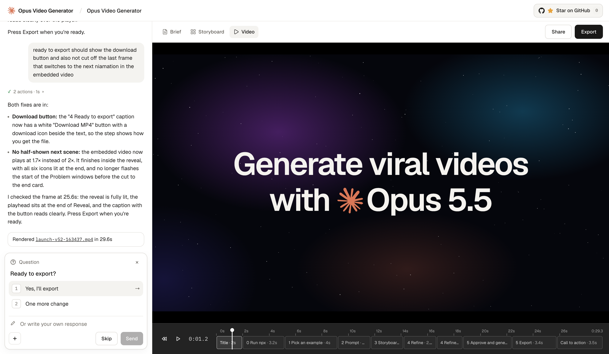

<div align="center">


# Opus Video Generator

Turn your product into a launch video with Claude Opus 5.5. Every frame is code.

[**Get started**](#get-started) &nbsp;•&nbsp; [Examples](https://github.com/athemeroy/awesome-opus-5-5-videos) &nbsp;•&nbsp; [Releases](https://github.com/samuelstroschein/opus-video-generator/releases)



</div>

## Get started

```bash
npx opus-video-generator
```

Needs [Claude Code](https://claude.com/claude-code), signed in with a Pro or Max plan, Node.js 20+ and Chrome. macOS or Linux (WSL on Windows).

## Features

- 🔍 **Researches your product**: reads your site, docs and files, then draws your real UI
- 🗂️ **Storyboard first**: one frame per beat, checked by a second agent before you see it
- 🎬 **Video as code**: one HTML page, every frame a function of time. Play, scrub, re-render
- 💬 **Edit by chatting**: "at 9s the zoom is too fast", "make the logo bigger"
- 🔥 **89 viral styles**: start from the most-liked Opus 5.5 videos on X
- 🔊 **Sound included**: royalty-free effects and music, in sync with the picture
- 📦 **1080p MP4 export**: rendered frame by frame, audio mixed to -14 LUFS

A 30-second video takes about 10–15 minutes and a few dollars' worth of plan usage. Projects are kept in `~/.opus-video-generator`. The app sends anonymous usage stats (typing and chat masked); turn them off with `--no-telemetry`.

## Develop

```bash
pnpm install
pnpm dev            # web :5173, API :8787, agent-written pages :8788
pnpm build:package  # npm package in dist/opus-video-generator
```

`apps/web` is the app, `apps/server` the API, agent tools and exporter, and `skills/launch-video` what the agent knows (instructions, templates, video engine, sound kit). See [docs/ARCHITECTURE.md](docs/ARCHITECTURE.md).

## Credits

Example styles from [awesome-opus-5-5-videos](https://github.com/athemeroy/awesome-opus-5-5-videos) by athemeroy (case notes under [CC BY 4.0](https://creativecommons.org/licenses/by/4.0/); videos belong to their creators and are not stored here). Sound effects from Kenney's [Interface Sounds](https://kenney.nl/assets/interface-sounds) (CC0).

## License

MIT
